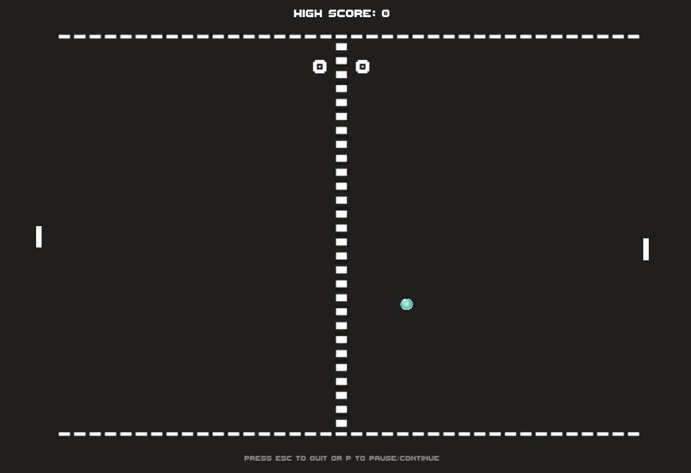

# Extreme Pong
This is a recreation of the classic 2D game 'Pong' but with a few twists.

### Preview



## Main features

- Single Player
- Computer AI
- Multiple levels with increasing difficulty
- Custom main menu splash screen
- Score tracking and high scores
- Pausing

## Requirements
```
Unity Version: 2019.2.2f1
```

## Installation
Here is how you can install this project:

```
$ git clone git@github.com:joshua-booth/extreme-pong.git
```

## Usage
Open the project in Unity Hub with the correct unity version.

### Building
To build the project navigate from the following:

```
File > Build and Run
```

or

```
File > Build Settings...
```

### Running
Locate your built project directory then click on the executable file or run the following command:

```
start "Extreme Pong.exe"
```
or
```
$ ./"Extreme Pong.exe"
```


## Authors

* [Joshua Booth](https://github.com/Joshua-Booth)
* [Latrey Liu Chan](https://github.com/Unknown9927)